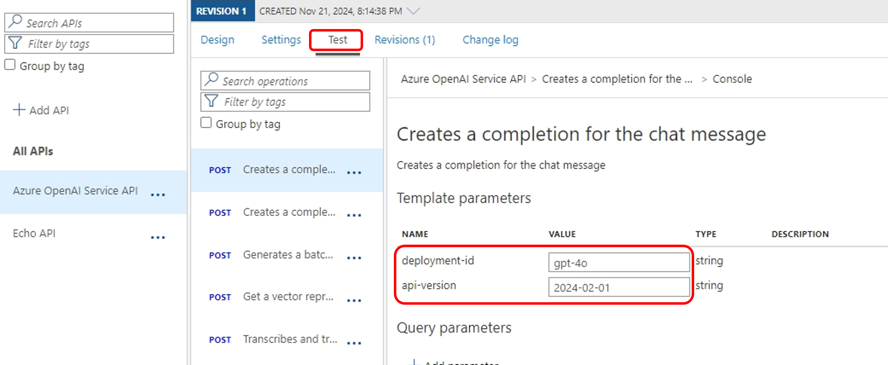

# Step 1. Azure API Management를 통하여 Azure OpenAI 액세스 하기

본 실습 단계에서는 Azure OpenAI(aka. AOAI)와 Azure API Management(aka. APIM) 리소스를 생성하고, Azure API Management에 Azure OpenAI의 API를 Import하여 APIM의 Gateway를 통하여 AOAI의 Chat Completion API를 호출해봅니다.

## Azure 리소스 생성

### Azure OpenAI 리소스 생성 및 모델 배포

1. [Azure Portal](https://portal.azure.com/)으로 접속하여 새 리소스 만들기를 합니다. azure openai로 검색하여 Azure OpenAI 리소스를 생성합니다.

    

2. Resource group을 새로 만들고, Region은 West US로 선택하고, 이름과 가격 티어를 입력한 후 Next를 누르고 나머지 항목은 기본값으로 유지한 후 Azure OpenAI 리소스를 생성합니다. 이름은 aoai-nov26-instance1으로 입력합니다.

    

3. 생성된 Azure OpenAI 리소스로 이동합니다. "Resource Management" 아래의 "Key and Endpoint" 메뉴를 클릭하여 Azure OpenAI 리소스의 API-Key와 Endpoint를 복사하여 메모장에 기록합니다.

    

4. "Go to Azure OpenAI Studio"를 클릭하여 Azure OpenAI Studio를 오픈합니다.

    

5. 모델을 배포합니다. "Deployments" 메뉴에서 "+ Deploy model"을 클릭하고 "Deploy base model"을 선택합니다.

    

6. 본 실습에서는 gpt-4o 모델을 배포하도록 하겠습니다.

    

7. Deployment name에 "gpt-4o"를 입력하고, Deployment type은 "Standard"로 선택합니다. 나머지 항목은 기본값으로 유지한 후 "Deploy" 버튼을 누릅니다.

    

### Azure API Management 리소스 생성

8. [Azure Portal](https://portal.azure.com/)에서 새 리소스 만들기를 합니다. API Management로 검색하여 Azure API Management 리소스를 생성합니다.

    

9. 고유한 Resource name, 적당한 Organization name과 Administrator email (리소스 생성이 완성되면 알림이 보내짐)을 입력합니다. 가격 티어는 Developer를 선택하여도 괜찮습니다. Azure API Management 생성이 완료되면 리소스로 이동합니다.

    

## Azure API Management에 Azure OpenAI API Import 하기

10. 본 실습에서는 Azure OpenAI의 액세스를 api-key로 인증하는 방법을 구현합니다. Azure API Management로 이동 후, 좌측 "APIs" 아래의 "Named values"를 메뉴에서 "+ Add"를 클릭합니다. 

    

11. Name과 Display name을 "openai-api-key"로 입력하고, 먼저 생성한 Azure OpenAI 리소스의 api-key를 Secret 형태로 저장합니다.

    

12. 이 단계에서는 API가 호출할 Backend, 즉 Azure OpenAI 리소스에 대한 설정을 진행합니다. 좌측 APIs 메뉴에서 "Backends"를 선택한 후, "+Add"를 클릭하고 Backend 관련 정보를 입력합니다. Name을 "openai-instance1'이라고 입력하고, Runtime URL에 Azure OpenAI의 Endpoint + "/openai"를 입력한 후 (예: https://aoai-nov26-instance1.openai.azure.com/openai) 생성 버튼을 클릭합니다.

    

13. 이제 API를 생성합니다. 이번 실습에서는 OpenAPI specification을 다운로드하여 설정하는 방법으로 진행합니다. 먼저, "APIs" 메뉴에서 "+Add API"를 클릭한 후 "Create from definition" 아래에 있는 "OpenAPI"를 선택합니다.

    

14. Azure OpenAI REST API의 OpenAPI 스펙의 [2024-02-01 GA version](https://github.com/Azure/azure-rest-api-specs/blob/main/specification/cognitiveservices/data-plane/AzureOpenAI/inference/stable/2024-02-01/inference.json)을 다운로드합니다. 다운로드 받은 inference.json 파일의 "servers" 아래 "url"과 "endpoint"의 "default"를 Azure OpenAI의 EndPoint로 변경합니다.

        '''
        "servers": [
            {
            "url": "https://{your-aoai-name}.openai.azure.com/openai",
            "variables": {
                "endpoint": {
                "default": "https://{your-aoai-name}.openai.azure.com/"
                }
            }
            }
        ],
        '''

15. 아래의 화면에서 inference.json 파일을 업로드하고, Display name, Name, API URL suffix를 입력하여 생성합니다.

    

16. 생성된 API의 Inbound processing 항목에서 </>를 클릭하고 Policies를 설정합니다. 

    

17. Policy를 아래와 같이 변경합니다. backend-service-id를 위에서 생성한 Backend인 "openai-instance1"로, api-key를 Named values에서 생성한 "openai-api-key"로 설정하는 Policy입니다.

    

        '''
        <policies>
            <inbound>
                <base />
                <set-backend-service id="apim-generated-policy" backend-id="openai-instance1" />
                <set-header name="api-key" exists-action="override">
                    <value>{{openai-api-key}}</value>
                </set-header>
            </inbound>
            <backend>
                <base />
            </backend>
            <outbound>
                <base />
            </outbound>
            <on-error>
                <base />
            </on-error>
        </policies>
        '''

18. 이제 api-key, Backend, API Policy에 대한 설정이 모두 완료되었습니다. Azure API Management의 Gateway를 통하여 Azure OpenAI Endpoint를 호출하여 Chat Completion에 대한 응답을 받아올 수 있는지 테스트 합니다. Test 탭에서 첫번째 API인 "Creates a completion for the chat message"를 선택합니다. 'deployment-id"에는 Azure OpenAI에서 배포한 Model의 이름을 넣습니다. (참고:위의 단계에서는 "gpt-4o"를 배포하였습니다.) api-version은 OpenAPI 스펙의 버전을 입력합니다. (참고: 위의 단계에서는 "2024-02-01"의 inference.json을 사용 하였습니다.

    

19. Request Body에 아래 예제를 복사하여 프롬프트를 입력한 후 "Send" 버튼을 클릭합니다.

    

        '''
        {
        "messages": [
            {
            "role": "system",
            "content": [
                {
                "type": "text",
                "text": "You are an AI assistant that helps people find information."
                }
            ]
            },
            {
            "role": "user",
            "content": [
                {
                "type": "text",
                "text": "when Microsoft Windows was built?"
                }
            ]
            }
        ],
        "temperature": 0.7,
        "top_p": 0.95,
        "max_tokens": 800
        }
    '''
20. Http response에 "HTTP/1.1 200 OK" 응답과 함께 프롬프트에 대한 답변이 정상적으로 출력되면, Azure API Management Gateway를 통하여 성공적으로 Azure OpenAI의 API를 호출한 것입니다.

    

## 실습 순서

* [Step1. Azure API Management를 통하여 Azure OpenAI 액세스 하기](https://github.com/jeongaelee/ProjectMooModule3/blob/main/Step1.md)
* [Step2. Azure API Management로 Token rate limiting](https://github.com/jeongaelee/ProjectMooModule3/blob/main/Step2.md)
* [Step3. Azure API Management의 Backend Load Balancing](https://github.com/jeongaelee/ProjectMooModule3/blob/main/Step3.md)
* [Step4. HTTP Header로 Backend를 선택하여 Azure OpenAI On Your Data를 적용한 Azure OpenAI 서비스 호출](https://github.com/jeongaelee/ProjectMooModule3/blob/main/Step4.md)