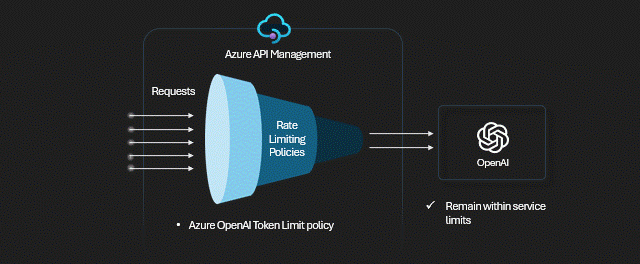
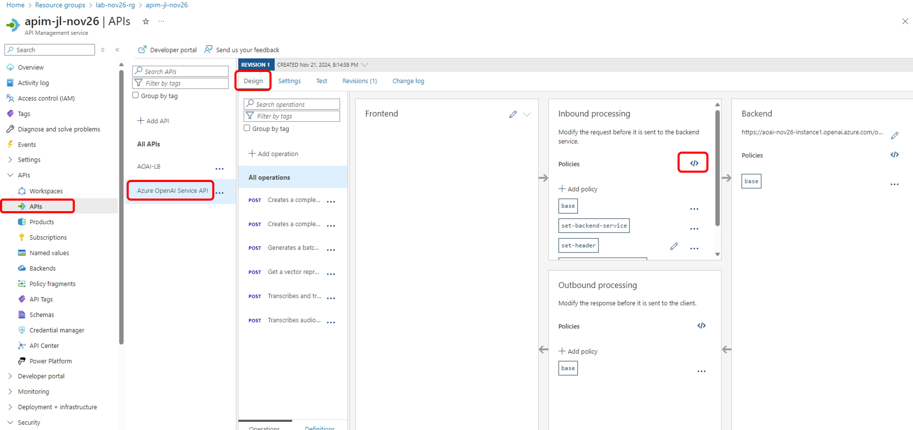
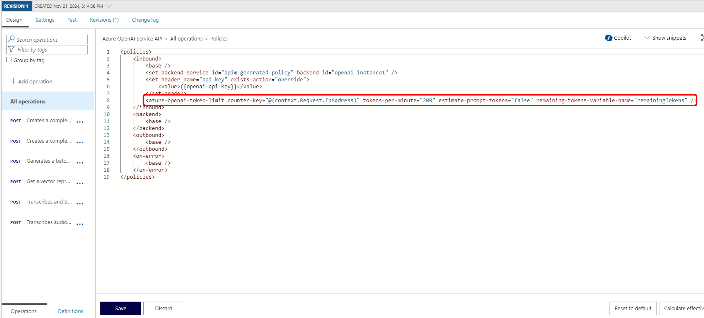
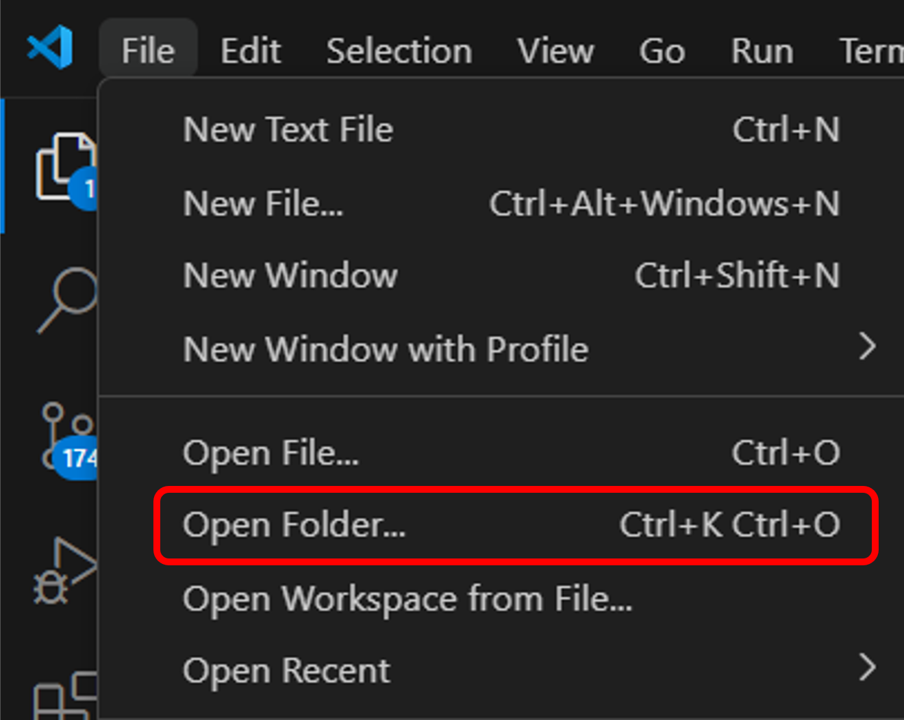
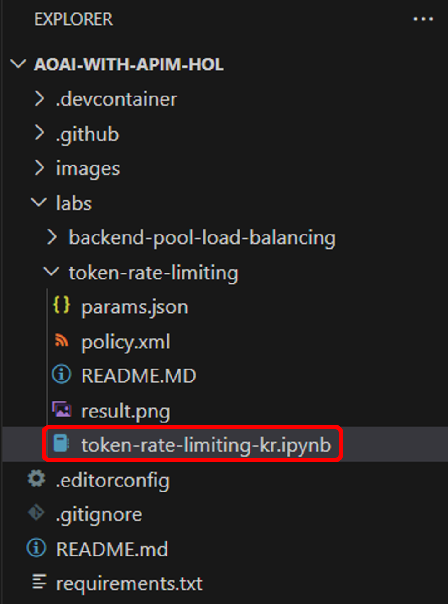

# Step2. Azure API Management를 사용하여 Azure OpenAI Token rate 제한하기

본 실습에서는 Azure API Managetment의 [token rate limiting policy](https://learn.microsoft.com/en-us/azure/api-management/azure-openai-token-limit-policy)를 적용하여 모델 토큰의 사용량을 Key 기반으로 분당 지정된 수로 제한하여 Azure OpenAI Service API의 사용량이 급증하는 것을 방지합니다. 토큰 사용량이 초과되면 발신자는 "429 Too Many Requests" 응답 상태 코드를 받게 됩니다.



## Azure API Management에서 token rate limiting policy 설정

1. [Azure Portal](https://portal.azure.com/)에서 이전 단계에서 생성한 Azure API Management 리소스의 APIs의 Design 탭을 엽니다. Design 메뉴에서 Inbound processin에 있는 Policy를 수정합니다.

    

2. Inbound policy에 아래의 policy를 복사하여 추가하고 저장합니다.

    

    ```
    <azure-openai-token-limit counter-key="@(context.Request.IpAddress)" tokens-per-minute="200" estimate-prompt-tokens="false" remaining-tokens-variable-name="remainingTokens" />
    ```
## Python Notebook에서 token rate limiting 테스트

1. 아래의 Github repository를 다운로드 하거나 Git Clone 합니다.

    ```
    git clone https://github.com/jeongaelee/projectmoo3code
    ```

2. 다운로드 받은 소스 코드를 Visual Studio Code에서 오픈합니다.

    

3. token-rate-limiting 폴더의 token-rate-limiting-kr.ipynb을 오픈하여 각각의 단계를 실행합니다.

    

## 실습 순서

* [Azure API Management를 통하여 Azure OpenAI 액세스 하기](https://github.com/jeongaelee/ProjectMooModule3/blob/main/Step1.md)
* [Token rate limiting](https://github.com/jeongaelee/ProjectMooModule3/blob/main/Step2.md)
