# Azure API Management를 사용하여 Azure OpenAI Load Balancing

본 실습에서는 Azure API Managetment에서 built-in으로 제공되는 [backend pool functionality of APIM](https://learn.microsoft.com/en-us/azure/api-management/backends?tabs=bicep)를 적용하여 여러개의 Azure OpenAI endpoint를 로드 밸런싱하는 기능을 구현해봅니다.

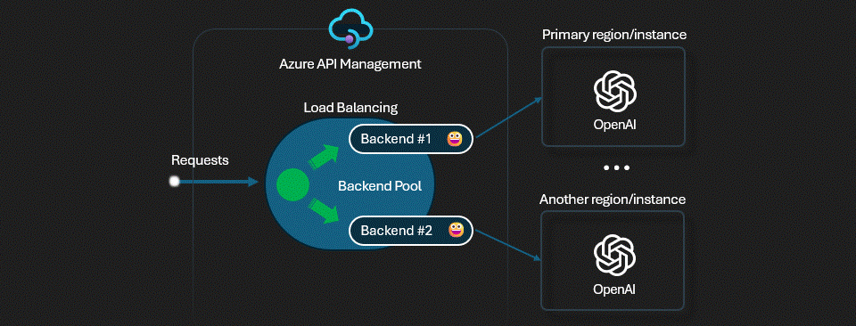

## Load Balancing을 위한 추가 Azure OpenAI 리소스 생성

1. Step 1의 Azure OpenAI 리소스 생성 및 모델 배포 과정을 한번 더 수행하여 동일할 리소스 그룹에 Azure OpenAI 리소스를 하나 더 생성합니다. Azure OpenAI 리소스 이름은 "aoai-nov26-instance2"으로 입력합니다.

## Azure API Management의 System Assigned Managed Identity 켜기

1. Azure API Management의 Managed Identity 메뉴에서 System assigned의 status를 "On"으로 설정합니다.

    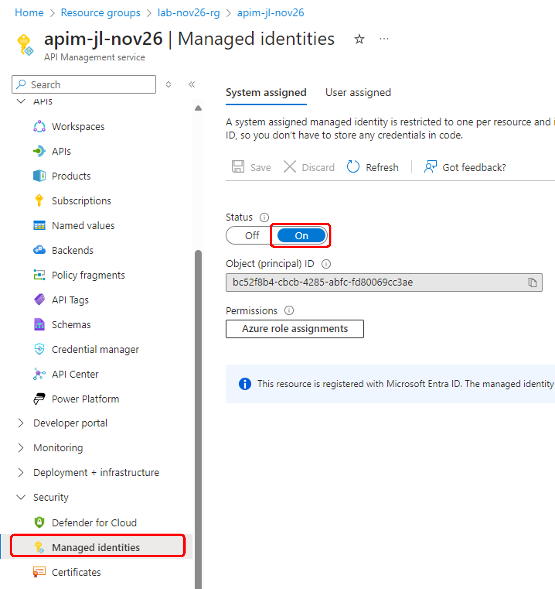

[Azure API Management를 사용하여 Azure OpenAI API에 대한 액세스 인증 및 권한 부여](https://learn.microsoft.com/ko-kr/azure/api-management/api-management-authenticate-authorize-azure-openai)하는 방법에는 이전 단계에서 사용한 API 요청에 API 키를 전달하는 방법이외에 Managed Identity (관리 ID)를 사용하여 인증, ID 공급자를 사용한 OAuth 2.0 권한 부여 방법등이 있습니다.

본 과정은 Azure OpenAI 인스턴스를 두개 이상 호출하는 로드발란싱 기능을 실습하기 위하여, Azure API Management Gateway에서 Azure OpenAI를 액세스하는 인증으로 "Managed Identity"를 사용합니다. 아래 과정을 통하여 이전 단계에서 생성한 Azure OpenAI Instance1과 위에서 생성한 추가 Instance2에 Managed Identity로 액세스 하는 방법을 설정합니다.

*아래의 단계는 Azure OpenAI Instance1과 Instance2에 모두 적용합니다.

## Azure OpenAI에 role assignment 추가하기

1. Azure OpenAI 리소스로 이동하여 "Access control (IAM)" 메뉴에서 "Add role assignment" 버튼을 클릭합니다.

    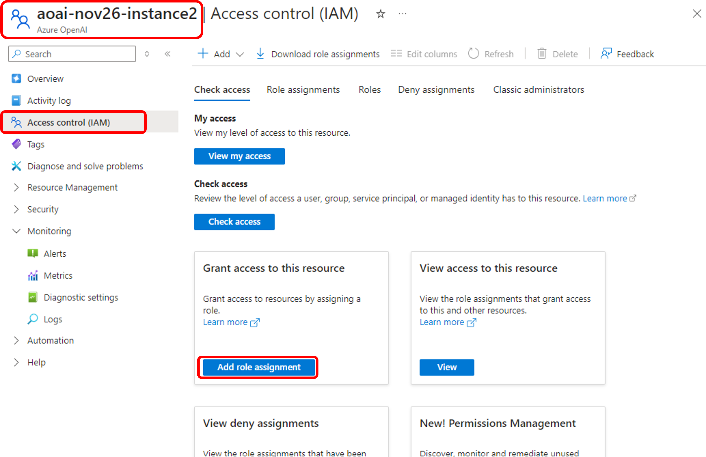

2. "Add role assignment" 메뉴의 "Role" 탭을 선택하고 Job function roles의 검색창에 "Cognitive Services OpenAI User"를 입력합니다. "Cognitive Services OpenAI User"를 선택하고 "Next"를 클릭합니다.

    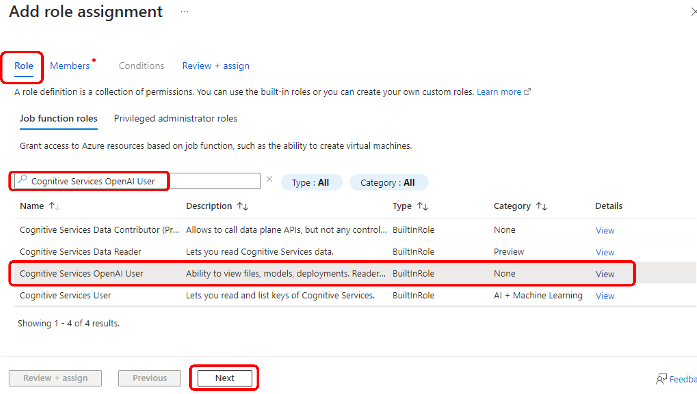

3. "Member" 탭에서 "Managed identity"를 선택하고 "Next"를 클릭합니다.

    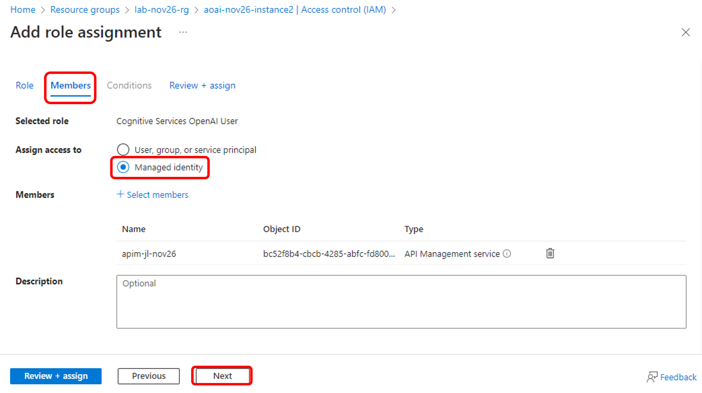

4. "Select managed identities"에서 구독을 선택하고 "Managed Identity"에서 API Management Service를 선택하면 이전 단계에서 생성하였던 API Management 리소스가 리스트 됩니다. API Management를 member로 선택한 후 "Select" 버튼을 클릭하고 저장합니다.

    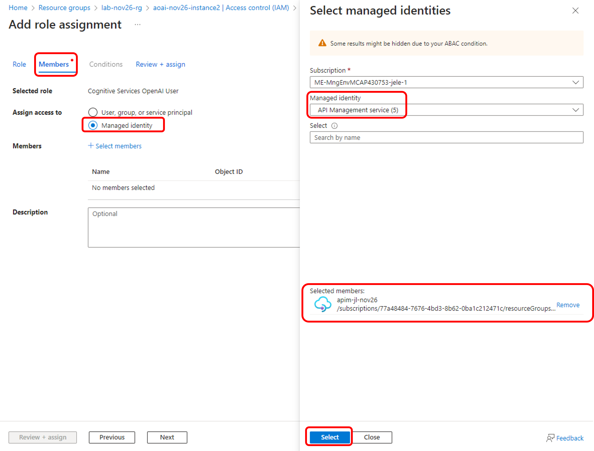

*위의 1~4 과정을 Azure OpenAI Instance2에도 적용합니다.

5. 이제 API Management 리소스로 이동합니다. "Security" 메뉴 아래의 "Managed identities"를 클릭합니다. Permissions 아래의 "Azure role assignments" 버튼을 선택합니다.

    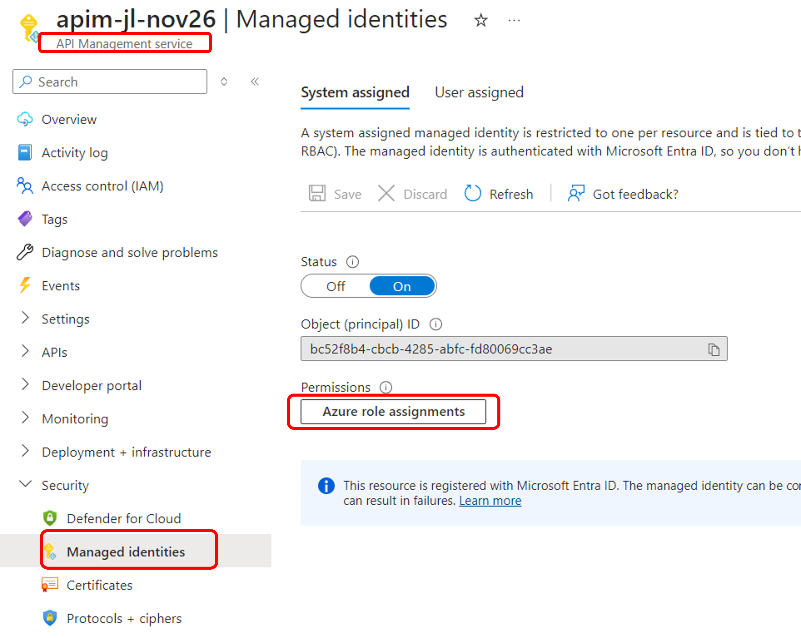

6. "Azure role assignments"에서 두개의 Azure OpenAI Instance가 API Management에 assigned to 된 것을 확인할 수 있습니다.

    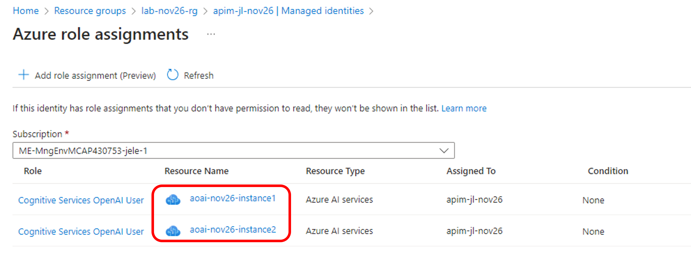

## API Management에 Instance2 Backend와 Backend Pool 추가

[API Management의 Backend](https://learn.microsoft.com/en-us/azure/api-management/backends?tabs=bicep)에는 Circuit breaker와 Load-balanced pool 기능이 제공됩니다. 본 실습에서는 Load Balancing 기능을 구현해 봅니다. API Management는 backend pool을 지원하여 API가 다수의 backends를 호출할때 backend 사이의 loac-balance를 해줄 수 있습니다.

API Management는 아래의 load balancing 옵션을 지원합니다.

* Round-robin: 디폴트로, 요청들은 Pool에 등록되어있는 Backend 간에 동일하게 분산됩니다.
* Weighted: 가중치가 Pool에 등록되어있는 Backend에 부여되고, 요청들이 부여된 가중치에 따라 상대적으로 분산됩니다. Blue-green deployment등을 구성할때 유용하게 사용할 수 있습니다.
* Priority-based: Backends는 우선순위 그룹에 의해서 구성되고, 요청들은 Priority group 순으로 backend에 보내집니다. Priority group 내에서는 요청들이 균일하게 분산되거나 Weight이 부여된 것에 따라서 상대적으로 분산됩니다.

* Note: 현재 기준으로 Backend Pool은 REST API, Bicep, ARM template으로 구성할 수 있습니다. (Azure Portal에서 아직 기능이 제공되지 않음) 본 실습에서는 Bicep 템플릿으로 Backend Pool을 구성하는 것을 실습해 보도록 하겠습니다.

1. Step2에서 다운로드 받은 코드에서 backend-pool-load-balancing 폴더의 backend-pool.bicep 파일을 오픈합니다.

    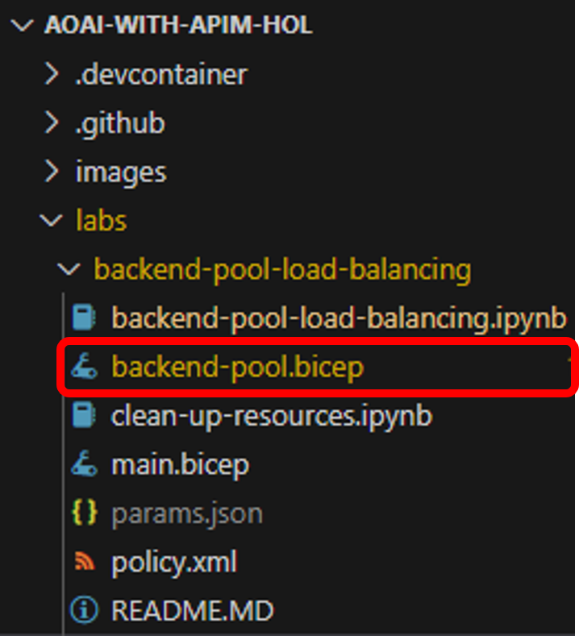

- Teamplate에서 아래 값을 입력합니다.

* {your-api-name}: API Management의 이름
* {your-subscription-id}: Subscription ID (구독 ID)
* {your-resource-group-name}: 리소스 그룹 명
* {your-open-ai-1}: Azure OpenAI 1번 리소스 (예: openai-instance1)
* {your-open-ai-2}: Azure OpenAI 2번 리소스 (예: openai-instance2)

    ```
    @description('The description of the OpenAI backend pool')
    param openAIBackendPoolDescription string = 'Load balancer for multiple OpenAI endpoints'

    resource backendPoolOpenAI 'Microsoft.ApiManagement/service/backends@2023-09-01-preview' = {
        name: '{your-api-name}/openai-instance-backend-pool'
        properties: {
            description: openAIBackendPoolDescription
            type: 'Pool'
            pool: {
            services: [
                {
                id: '/subscriptions/{your-subscription-id}/resourceGroups/{your-resource-group-name}/providers/Microsoft.ApiManagement/service/{your-api-name}/backends/{your-open-ai-1}'
                priority: 1
                weight: 2
                }
                {
                id: '/subscriptions/{your-subscription-id}/resourceGroups/{your-resource-group-name}/providers/Microsoft.ApiManagement/service/{your-api-name}/backends/{your-open-ai-2}'
                priority: 1
                weight: 1
                }
            ]
            }
        }
    }
    ```

Notes:
- Backend pool은 round-robin을 디폴트로 지원합니다.
- Priority와 weight 기반의 라우팅도 지원합니다. `openai_resources`의 `priority` (the lower the number, the higher the priority)와 `weight` 파라미터 변수를 변경하면 됩니다.
- 위의 설정에서는 weight 값을 다르게 하여 1번과 2번의 Azure OpenAI 인스턴스의 호출 빈도를 조정하였습니다.

2. Visual Studio Code에서 backend-pool-load-balancing.ipynb 파일을 오픈하여 아래 단계에 있는 bicep 실행 코드를 실행합니다.

    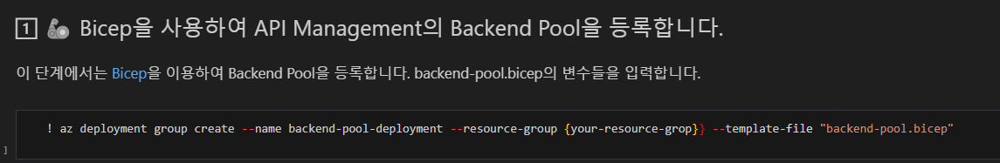

3. Azure Portal의 API Management의 Backends 메뉴에서 Backend가 모두 정상적으로 등록되었는지 확인합니다.

    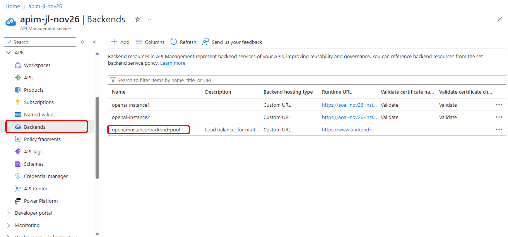

4. API를 추가하여 Backend Pool을 연결해 봅니다. 이번에는 이전에 만들었던 Azure OpenAI Service API를 Clone하여 새로운 만들어 보도록 하겠습니다. 

    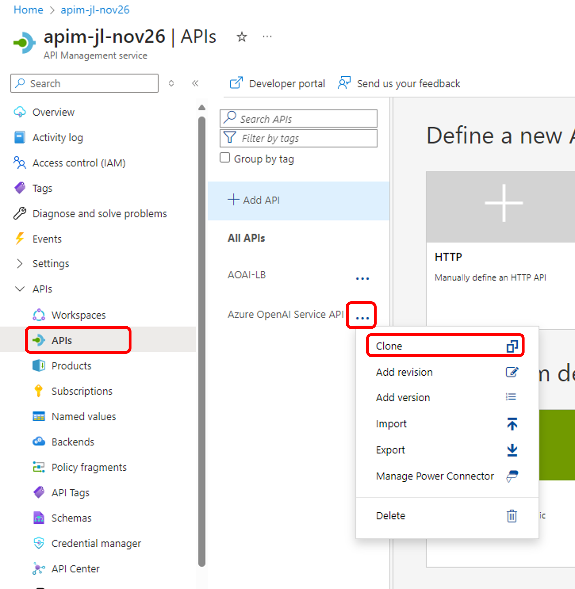

5. Clone한 API의 "Settings" 메뉴에서 Display name과 API URL suffix를 적절하게 변경합니다.

    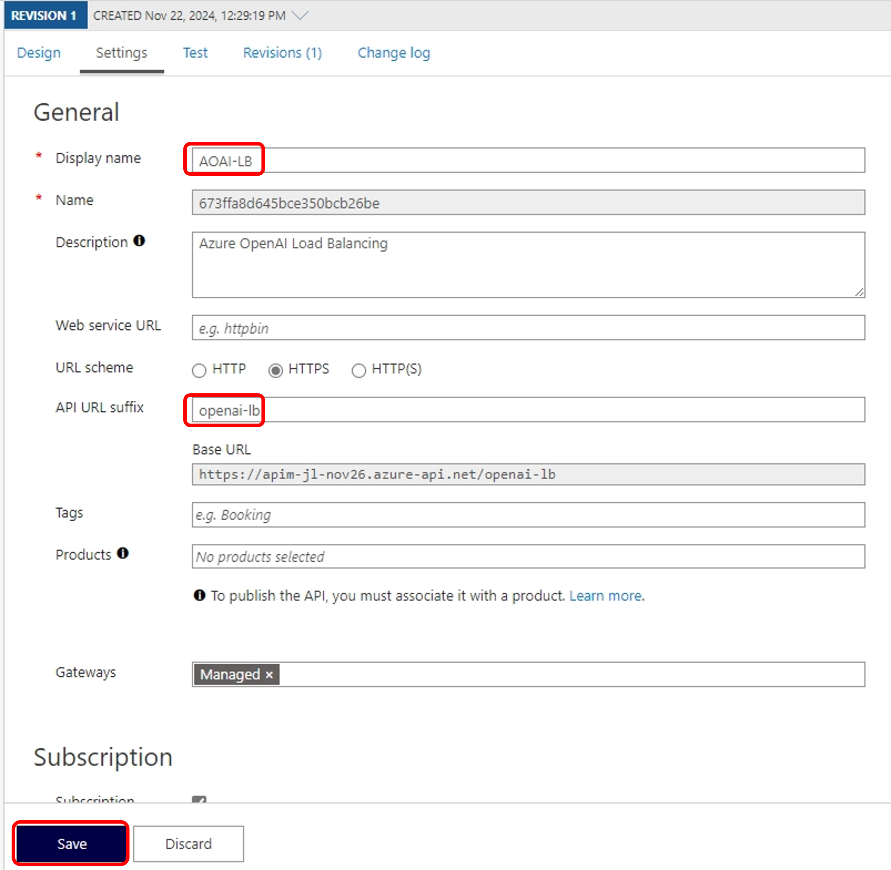

6. Design의 Inbound Policy에서 위에서 추가한 backend pool을 설정합니다.

    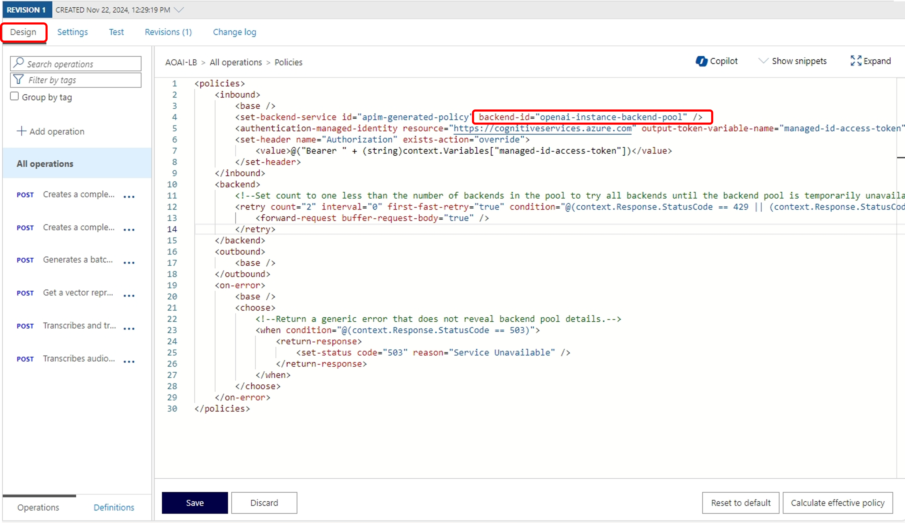

* 아래의 Policy를 복사하여 붙여넣고 설정을 확인합니다.

    ```
    <policies>
        <inbound>
            <base />
            <set-backend-service id="apim-generated-policy" backend-id="openai-instance-backend-pool" />
            <authentication-managed-identity resource="https://cognitiveservices.azure.com" output-token-variable-name="managed-id-access-token" ignore-error="false" />
            <set-header name="Authorization" exists-action="override">
                <value>@("Bearer " + (string)context.Variables["managed-id-access-token"])</value>
            </set-header>
        </inbound>
        <backend>
            <!--Set count to one less than the number of backends in the pool to try all backends until the backend pool is temporarily unavailable.-->
            <retry count="2" interval="0" first-fast-retry="true" condition="@(context.Response.StatusCode == 429 || (context.Response.StatusCode == 503 && !context.Response.StatusReason.Contains("Backend pool") && !context.Response.StatusReason.Contains("is temporarily unavailable")))">
                <forward-request buffer-request-body="true" />
            </retry>
        </backend>
        <outbound>
            <base />
        </outbound>
        <on-error>
            <base />
            <choose>
                <!--Return a generic error that does not reveal backend pool details.-->
                <when condition="@(context.Response.StatusCode == 503)">
                    <return-response>
                        <set-status code="503" reason="Service Unavailable" />
                    </return-response>
                </when>
            </choose>
        </on-error>
    </policies>
    ```

7. Visual Studio의 backend-pool-load-balancing.ipynb 코드로 이동하여 "🧪 직접 HTTP를 호출하여 API 테스트"를 실행합니다. 코드 실행 전 변수를 테스트 중인 Azure 리소스에 맞게 수정한 후 실행합니다.

8. 마지막으로 "🔍 Load Balancing 결과 분석"을 실행하여 West US의 Azure OpenAI와 East US의 Azure OpenAI 리소스가 Weight에 맞게 (3:1) 호출되었는지 결과를 확인합니다.

## 실습 순서

* [Step1. Azure API Management를 통하여 Azure OpenAI 액세스 하기](https://github.com/jeongaelee/ProjectMooModule3/blob/main/Step1.md)
* [Step2. Azure API Management로 Token rate limiting](https://github.com/jeongaelee/ProjectMooModule3/blob/main/Step2.md)
* [Step3. Azure API Management의 Backend Load Balancing](https://github.com/jeongaelee/ProjectMooModule3/blob/main/Step3.md)
* [Step4. HTTP Header로 Backend를 선택하여 Azure OpenAI On Your Data를 적용한 Azure OpenAI 서비스 호출](https://github.com/jeongaelee/ProjectMooModule3/blob/main/Step4.md)
